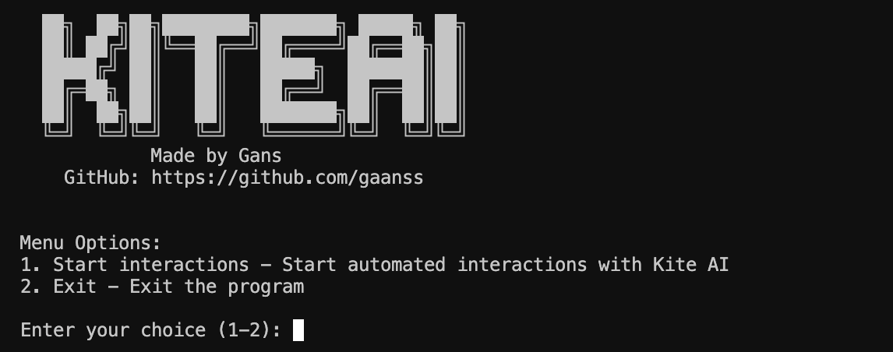

# 🤖 KiteAI Interaction Bot

<p align="center">
  <a href="https://t.me/gans_software">
    
  </a>
  <a href="https://t.me/ganssoftwarechat">
    
  </a>
</p>

This Python application automates interactions with the KiteAI chat platform. It allows you to send questions to the AI agent, receive responses, report usage, and collect statistics across multiple wallets.

## 🖥️ Interface

The bot features a simple console interface for easy interaction:

<p align="center">
  
</p>

## ✨ Features

- 🔄 Automate interactions with KiteAI chat for multiple wallets
- 🌐 Assign proxies to each wallet for distributed access
- ⏱️ Limit interactions per wallet to configurable daily thresholds
- 🔁 Automatic reset of interaction counter after 20 interactions
- 📊 Local tracking of interactions (independent of online statistics)
- 🧵 Use multithreading for concurrent processing
- 💾 Log all interactions in a local SQLite database
- 📝 Detailed logging with loguru
- ⚙️ Configure via YAML settings file

## 📋 Contents

- [Requirements](#-requirements)
- [Installation](#-installation)
- [Configuration](#-configuration)
- [Preparing Files](#-preparing-files)
- [Usage](#-usage)
- [Project Structure](#-project-structure)
- [Database Schema](#-database-schema)
- [Interaction Counting](#-interaction-counting)
- [Troubleshooting](#-troubleshooting)
- [Community Support](#-community-support)
- [License](#-license)

## 📦 Requirements

- Python 3.11
- Dependencies listed in `requirements.txt`

## 🔧 Installation

1. Clone the repository or download the source code

```bash
git clone https://github.com/gaanss/kiteai-bot.git
cd kiteai-bot
```

2. Create a virtual environment and activate it

```bash
python -m venv venv
# for Windows
venv\Scripts\activate
# for macOS/Linux
source venv/bin/activate
```

3. Install dependencies

```bash
pip install -r requirements.txt
```

## ⚙️ Configuration

The application is configured through `settings.yaml`. The following settings are available:

```yaml
# AI Interaction Settings
threads: 5                     # Number of concurrent threads
delay_between_interactions: 30 # Delay in seconds between interactions
agent_id: "deployment_xxxxx"   # Agent ID for API requests

# API Endpoints
chat_endpoint: "https://deployment-xxxxx.example.com/main"
report_usage_endpoint: "https://example.com/api/report_usage"
inference_endpoint: "https://example.com/v1/inference"
stats_endpoint: "https://example.com/api/user/{wallet_address}/stats"

# Database Settings
database_path: "kite_ai_interactions.db"

# Files
private_keys_file: "private_keys.txt"
proxies_file: "proxies.txt"
questions_file: "questions.txt"

# Logging
log_level: "INFO"  # Can be INFO, DEBUG, WARNING, ERROR
log_file: "kite_ai_bot.log"
```

## 📝 Preparing Files

Before running the program, you need to prepare the following files:

### 1. `private_keys.txt` - Wallet Private Keys

Create a `private_keys.txt` file and add private keys (one per line):

```
0xda7bd5c99a4409
0x64e4c001df012c
0x44f2924c5b82dd
# ... add more private keys as needed
```

### 2. `proxies.txt` - Proxy Server Settings

Create a `proxies.txt` file and add proxies (one per line in `username:password@ip:port` format):

```
gans:12345@1.1.1.1:3000
gans:12345@1.1.1.1:3001
# ... add more proxies as needed
```

### 3. `questions.txt` - Questions for AI

Create a `questions.txt` file with questions (one per line):

```
What is Kite AI?
How does Kite AI differ from other blockchain platforms?
What is Proof of AI (PoAI)?
# ... add more questions as needed
```

## 🚀 Usage

### Running the Bot

Run the bot with this command:

```bash
python main.py
```

The bot will run in continuous mode, automatically processing interactions for all wallets up to 20 interactions per wallet, then resetting the counter and continuing.

### Monitoring Operation

To view logs in real-time:

```bash
tail -f kite_ai_bot.log
```

### Viewing Statistics

Statistics are stored in the SQLite database. You can query the database to get statistics:

```bash
sqlite3 kite_ai_interactions.db "SELECT * FROM interactions ORDER BY timestamp DESC LIMIT 10;"
```

## 📁 Project Structure

```
kiteai-bot/
├── main.py                 # Main application entry point
├── client.py               # API client for KiteAI interaction
├── database.py             # SQLite database management
├── wallet.py               # Wallet management
├── settings.yaml           # Configuration file 
├── private_keys.txt        # List of private keys
├── proxies.txt             # List of proxies
├── questions.txt           # List of questions
├── requirements.txt        # Project dependencies
├── kite_ai_interactions.db # SQLite database (created automatically)
└── kite_ai_bot.log         # Log file (created automatically)
```

## 🗃️ Database Schema

The application uses a SQLite database with the following tables:

### Wallets Table

Stores wallet information and interaction counts.

| Field | Type | Description |
|------|-----|------|
| id | INTEGER | Primary key |
| private_key | TEXT | Private key (unique) |
| wallet_address | TEXT | Wallet address |
| proxy | TEXT | Proxy assigned to this wallet |
| interactions_today | INTEGER | Count of interactions today |
| last_interaction_date | TEXT | Date of last interaction |

### Interactions Table

Stores interaction details.

| Field | Type | Description |
|------|-----|------|
| id | INTEGER | Primary key |
| wallet_id | INTEGER | Foreign key to wallets table |
| question | TEXT | Question asked |
| response | TEXT | AI response |
| ttft | INTEGER | Time to first token (ms) |
| total_time | INTEGER | Total interaction time (ms) |
| timestamp | TEXT | Interaction timestamp |

## 🔢 Interaction Counting

### Local Counter vs. Online Statistics

This application uses a local SQLite database to track interaction counts, independent of the online KiteAI platform statistics. This ensures accurate daily interaction counting, as the online statistics may only track total interactions, not daily ones.

### Counter Reset

The interaction counter is automatically reset after a wallet reaches 20 interactions. This allows each wallet to continuously participate in interactions without manual intervention.

Key points about interaction counting:

- Each wallet can perform up to 20 interactions before counter reset
- Counter is reset automatically in the database after 20 interactions
- Daily interaction counts are maintained locally, not based on online statistics
- The system handles cases where the date changes by resetting counters appropriately

## 🔍 Troubleshooting

### Proxy Issues

If you see errors about invalid proxy format, make sure your proxies are specified in the correct format:
```
username:password@host:port
```

### Wallet Issues

If the bot can't import private keys, ensure that:
- Keys have the correct format (64 hex characters or with 0x prefix)
- Each key is on a separate line

### Connection Errors

If the bot can't connect to the API:
- Check your internet connection
- Make sure the API endpoint settings in `settings.yaml` are correct
- Verify your proxy servers are working

## 💬 Community Support

If you have any questions or need assistance with the KiteAI Interaction Bot, feel free to join our Telegram group:

👉 [Join the Gans Software Chat](https://t.me/+dplOhe1WKCwwMjgy)

Our community is active and helpful, and the developers are available to answer your questions and provide support.

## 📄 License

This project is licensed under the MIT License - see the LICENSE file for details. 
